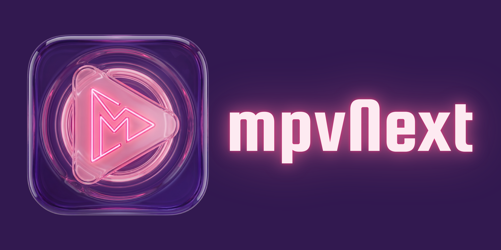
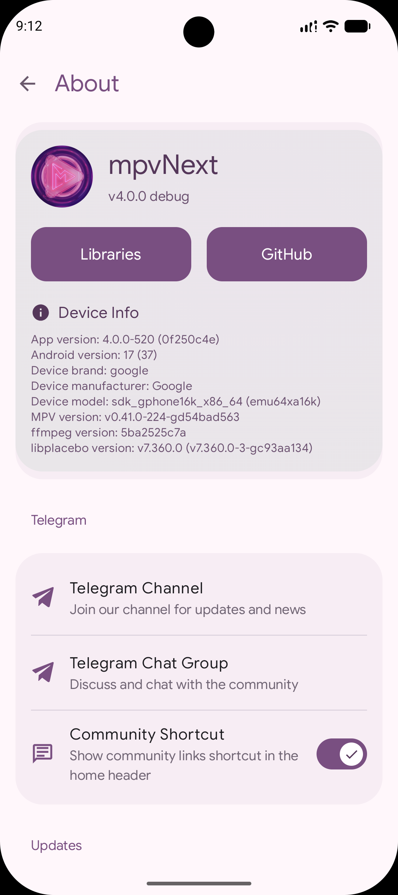

# mpvNext

  

  <b>Feature-rich Android video player based on libmpv.</b>

  
  
  
  

mpvNext is an advanced, customizable video player for Android. It combines the versatility of libmpv with a modern Jetpack Compose interface and unique user-centric features.

---

## Showcase

  
  
<i>Player UI — Material You adaptive controls, seek capsule OSD, and gesture zones</i>

  
  
  

<i>Video browser · Picture-in-picture · About screen</i>

  
  

<i>Playlist window · File options sheet</i>

---

## Features

Based on mpvEx & mpvRex, with additional enhancements, optimizations and own customizations built on top.

*   **Subtitle Swipe Seeking:** Intuitive gestures to jump between subtitle lines.
*   **Refined Tap Logic:** Enhanced single-tap response with exclusion zones and reverse double-tap options.
*   **Accidental Seek Prevention:** Optional ignore-single-tap on seekbar to prevent mistakes.
*   **Smart Orientation:** Persistent per-video orientation preferences with intelligent fallback.
*   **Enhanced Background Playback:** Optimized battery-saving mode with seamless, stutter-free transitions.
*   **Themed Player Controls:** Adaptive controls that dynamically match your app theme or system accent (Material You).
*   **Shorts Mode:** Optimized vertical playback experience with auto-swipe support for "Shorts" and Reels.
*   **Audio Support:** Integrated capability to play audio files directly within the media engine.
*   **Advanced Thumbnails:** Extraction strategy choice (First Frame vs. Specific Position) and network stream previews.
*   **Modern Aesthetics:** Seamless transitions, custom branding, and specialized "Always Dark Mode" for player.
*   **Modular Architecture:** Robust Ops/Manager-driven file browser with a unified discovery engine.
*   **Unified UI:** Standardized media cards featuring reactive "NEW" badges and recursive file/folder counts.
*   **Enhanced Navigation:** Auto-scrolling synchronized chapters and support for relative seeking.
*   **Centralized "More Sheet":** Quick access to all player buttons and custom controls.
*   **In-Player Interaction:** Real-time toggling of over 10+ player settings (gestures, PiP, UI behavior) without leaving playback.
*   **Subtitle Management:** Visual indicators for primary tracks and integrated online search.

---

## Installation

Download the latest stable version from the [GitHub releases page](https://github.com/aransari1/mpvNext/releases).

  
  

  <i>Note: Previews may be unstable and are intended for testing purposes only.</i>

---

## Credits

mpvNext is a fork of **[mpvEx](https://github.com/marlboro-advance/mpvEx)** (based on **[mpv-android](https://github.com/mpv-android/mpv-android)**). Special thanks for the foundation and inspiration:

[mpvEx](https://github.com/marlboro-advance/mpvEx) • [mpvRex](https://github.com/sfsakhawat999/mpvRex) • [mpvRx](https://github.com/Riteshp2001/mpvRx) • [mpv-android](https://github.com/mpv-android) • [mpvKt](https://github.com/abdallahmehiz/mpvKt) • [Next player](https://github.com/anilbeesetti/nextplayer) • [Gramophone](https://github.com/FoedusProgramme/Gramophone)

---

## License

Distributed under the **Apache License 2.0**. See `LICENSE` for more information.

---
## Star History 

<a href="https://www.star-history.com/#aransari1/mpvNext&type=date&legend=top-left">
 <picture>
   <source media="(prefers-color-scheme: dark)" srcset="https://api.star-history.com/svg?repos=aransari1/mpvNext&type=date&theme=dark&legend=top-left" />
   <source media="(prefers-color-scheme: light)" srcset="https://api.star-history.com/svg?repos=aransari1/mpvNext&type=date&legend=top-left" />
   
 </picture>
</a>
